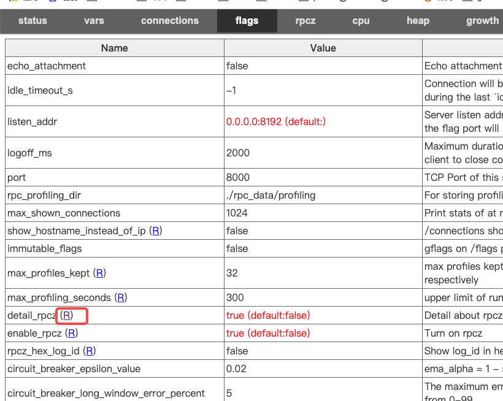
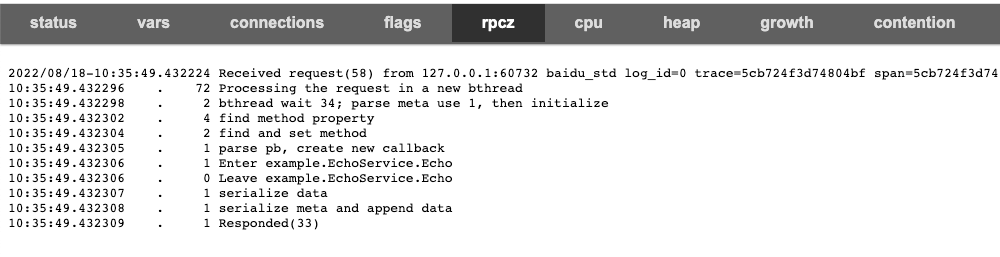
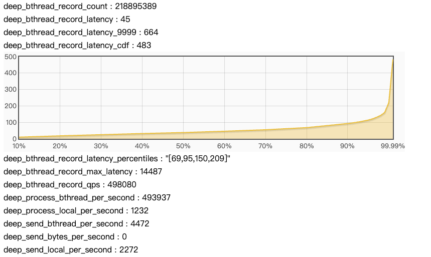

# 功能说明
在brpc上增加了 server 端更详细的阶段性时间展示。新增代码对性能影响不大
代码位置：https://github.com/deepld/brpc-annotation/commit/fa193813e746ecc40b6ca8682a22273f20d0fa2e

# 结论
1. server接受的请求，一部分在当前线程直接处理，一部分开启新的bthread解析处理。压力极大时，发送到bthread的请求增多，平均延迟可以达到 30us
2. 开启新bthread执行延迟，并非全部是bthread自身切换造成的耗时，主要任务较多，排队造成的延迟变高
3. client single模式下，client的socket请求会批量发送，server端会开启更多的bthread去并发执行

# 打开方式
打开rpcz的情况下 --enable_rpcz，同时传入 --detail_rpcz；
./echo_server --listen_addr 0.0.0.0:8192 --enable_rpcz --detail_rpcz

或者可通过 web 动态打开或者关闭

# 

# 指标查看
## RpcZ
如图：从socket读取数据后，请求处理丢到 bthread中，34us之后bthread开始处理；

# 

## Bars
deep_bthread_record_latency：从Task丢入到bthread到开始执行的平均延迟。
deep_process_bthread_per_second : 从sock接收到数据后，每秒有多少请求并发丢到 bthread中
deep_process_local_per_second : 从sock接收到数据后，每秒有多少请求直接在 dispatch 线程执行
deep_send_bthread_per_second : 发送回应时，每秒有多少请求丢到bthread中 send
deep_send_local_per_second : 发送回应时，每秒有多少请求直接在当前线程 send 完成

# 

